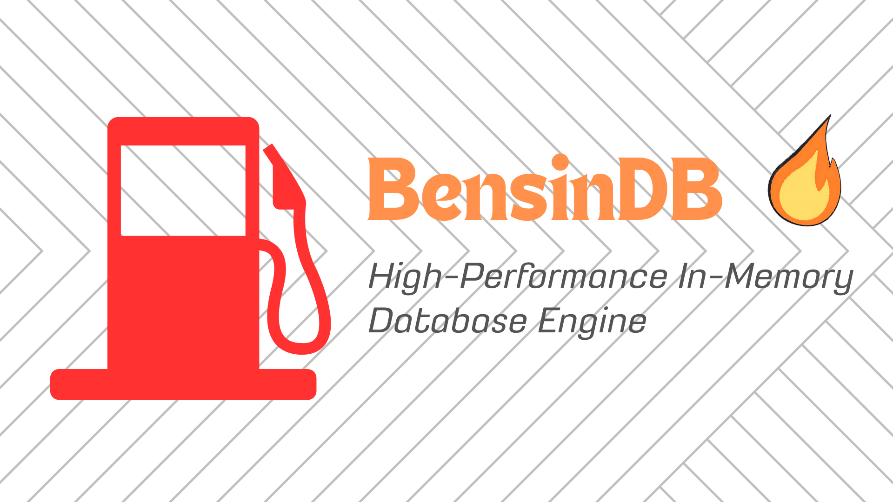

# BensinDB



<div align="center">
<br>

  [](https://go.dev/)
  [](LICENSE)
  [](https://golang.org/cmd/cgo/)
  
  **Performa Tinggi. Zero Dependencies. 100% Pure Go.**
</div>


---

**BensinDB** adalah *High-Performance In-Memory Database Engine* yang ditulis 100% menggunakan bahasa pemrograman Go. Dirancang untuk aplikasi yang membutuhkan latensi ultra-rendah dan efisiensi memori maksimal tanpa beban ketergantungan pada CGO (C Go Interaction Layer). Serta menggunakan ekstensi `.bensin` pada setiap database disimpan.

## Filosofi di Balik BensinDB

<div align="center">
  
  
</div>

Nama **BensinDB** lahir dari ironi yang akrab di telinga kita: bensin oplosan atau campuran. Di jalanan, bensin oplosan menjanjikan harga murah dan performa tinggi, namun realitanya? Mesin rusak, performa drop, dan biaya perbaikan yang mahal.

Filosofi **BensinDB** adalah kebalikannya:
**Kami ingin memberikan "Bensin Murni, Bukan Oplosan" untuk aplikasi Go Anda.** Tanpa campuran CGO, tanpa bahan pengotor dependensi eksternal yang memperlambat atau merusak performa. BensinDB berkomitmen untuk menyediakan performa database yang **bersih, murni, dan secepat kilat** seperti bahan bakar oktane tinggi, yang benar-benar dirancang untuk mesin Go Anda.

## Mengapa BensinDB?

Dalam pengujian benchmark ketat melawan SQLite (CGO), BensinDB terbukti:
* **~12.000x Lebih Cepat** pada operasi murni (Pure Op).
* **~68x Lebih Cepat** pada operasi pemindaian data (Select).
* **Efisiensi Memori Kompetitif**: Mengungguli SQLite dengan selisih rata-rata 15% lebih irit.
* **Zero CGO**: Tidak membutuhkan GCC atau dependensi eksternal. Portabilitas murni Go.

## Hasil Benchmark (Rata-rata dari 5 Percobaan)

Pengujian dilakukan pada CPU **AMD Ryzen 5 5600H** menggunakan perintah `go test -bench=Benchmark -benchmem -count=5`.

| Fitur | SQLite (v3.x) | **BensinDB (Native)** | Status |
| :--- | :--- | :--- | :--- |
| **Pure Latency** | ~3,382,773 ns/op | **~258.3 ns/op** | **Menang Telak (12.000x)** |
| **Select Op** | ~913,585 ns/op | **~13,300 ns/op** | **Menang Telak (68x)** |
| **Memory Usage** | 359 B/op | **~312 B/op** | **Menang Tipis (15%)** |
| **Allocations** | 12 allocs/op | **5 allocs/op** | **Sangat Stabil** |


> **Catatan Objektif:** SQLite sangat efisien karena ditulis dalam C, namun akses melalui CGO pada Go memberikan beban latensi yang besar. BensinDB menghilangkan beban tersebut, memberikan kecepatan akses instan sambil tetap mempertahankan penggunaan memori yang lebih rendah daripada SQLite di ekosistem Go.

## Fitur Utama

- **Strongly Typed**: Mendukung tipe data `INT`, `FLOAT`, dan `TEKS` dengan validasi ketat.
- **Relational Operations**: Mendukung `Join`, `Union`, `GroupBy`, dan `OrderBy`.
- **Low GC Pressure**: Hanya menggunakan rata-rata 5 alokasi per operasi, menjaga performa tetap stabil dari gangguan Garbage Collector.
- **Thread-Safe Ready**: Dirancang untuk skenario *high-concurrency*.

## Instalasi

```bash
go get github.com/Dziqha/BensinDB
```
## Ekstensi VS Code (BensinDB Editor)

Gunakan GUI untuk mengelola file `.bensin` secara visual.

> Cari Extension: Buka menu Extensions di VS Code (Ctrl+Shift+X) dan cari `BensinDB Editor` oleh Abdurrohman Haadziq.

## Syntax yang Intuitif

| Operasi | BensinDB (FQL) | SQL Traditional |
|---------|----------------|-----------------|
| Create Table | `BUAT TANGKI pengguna (...)` | `CREATE TABLE users (...)` |
| Insert | `ISI KE pengguna (...)` | `INSERT INTO users (...)` |
| Select | `PILIH * DARI pengguna` | `SELECT * FROM users` |
| Update | `ATUR pengguna SET ...` | `UPDATE users SET ...` |
| Delete | `BAKAR DARI pengguna` | `DELETE FROM users` |
| Join | `GABUNG tangki_a DAN tangki_b` | `JOIN table_a ON table_b` |
| Union (Alias) | `SATUKAN tangki_a, tangki_b` | `UNION` |
| Union (Operator) | `CAMPUR TANGKI tangki_a + tangki_b` | `UNION` |
| Order By | `URUTKAN TANGKI pengguna BERDASARKAN nama` | `ORDER BY name` |
| Group By | `GRUPKAN TANGKI pengguna BERDASARKAN kategori` | `GROUP BY category` |


## Contoh Penggunaan Quick Start

```go
package main

import (
    "fmt"
    "github.com/Dziqha/BensinDB/pkg/engine"
)

func main() {
    // Buka/buat database
    db, err := engine.OpenTangki("pertamax.bensin")
    if err != nil {
        panic(err)
    }
    defer db.Close() // Auto-save saat close
    
    // Buat tabel
    db.Jalankan("BUAT TANGKI products (id INT, nama TEKS, harga FLOAT)")
    
    // Insert data
    db.Jalankan("ISI TANGKI products NILAI (1, 'Laptop', 15000000)")
    db.Jalankan("ISI TANGKI products NILAI (2, 'Mouse', 250000)")
    
    // Query data
    results, _ := db.Query("PILIH * DARI products DIMANA harga > 100000")
    
    for _, row := range results {
        fmt.Printf("ID: %v, Nama: %v, Harga: %v\n", 
            row["id"], row["nama"], row["harga"])
    }
}
```
---

## Contributing

Kontribusi sangat diterima! Silakan:

1. Fork repository ini
2. Buat feature branch (`git checkout -b feature/AmazingFeature`)
3. Commit changes (`git commit -m 'Add some AmazingFeature'`)
4. Push ke branch (`git push origin feature/AmazingFeature`)
5. Buat Pull Request

---

## License

Distributed under the MIT License. See `LICENSE` for more information.

---

<div align="center">
  
  ### ⛽ Isi Tangki Aplikasi Anda dengan BensinDB
  
  **Premium Performance. Zero Compromises. 100% Indonesian.**
  
  [](https://github.com/Dziqha/BensinDB)
  [](https://github.com/Dziqha/BensinDB)
  
  Dibuat dengan ❤️ untuk performa maksimal. **BensinDB - High Octane Database for Go.**
  
</div>
